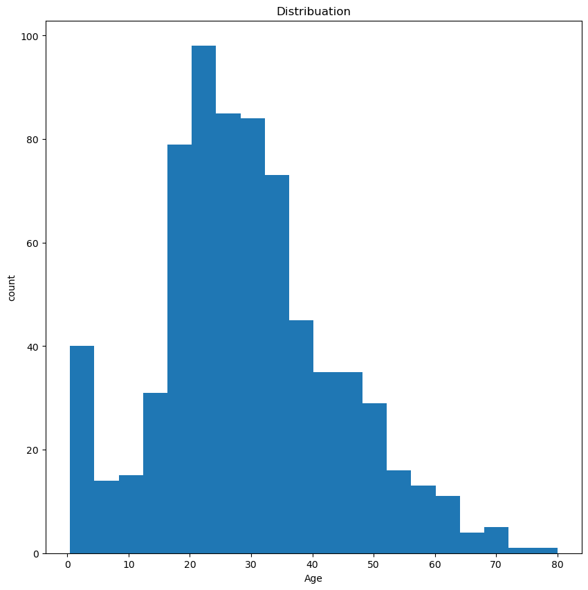
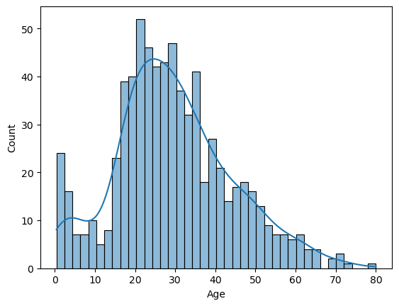

# Data Visualization Practice 📊

This repository contains my practice sessions on Data Visualization using Python. 

## Project Overview
In this project, I used **Pandas** for data manipulation and **Matplotlib/Seaborn** for creating visualizations.

### Visualizations Output:
Here are some of the charts generated from the `visual.ipynb` notebook:

## Files in this Repository:
- `visual.ipynb`: The main Jupyter Notebook with the code.
- `Titanic-Dataset.csv`: The dataset used for analysis.
- `output.png`: Exported charts.
